  This Genesys Cloud Developer Blueprint demonstrates how to integrate Messenger with the identity provider, Okta, in order to use SSO to authenthicate Messenger across multiple domains. This blueprint also includes the steps to set up an Okta account to obtain authorization credentials.

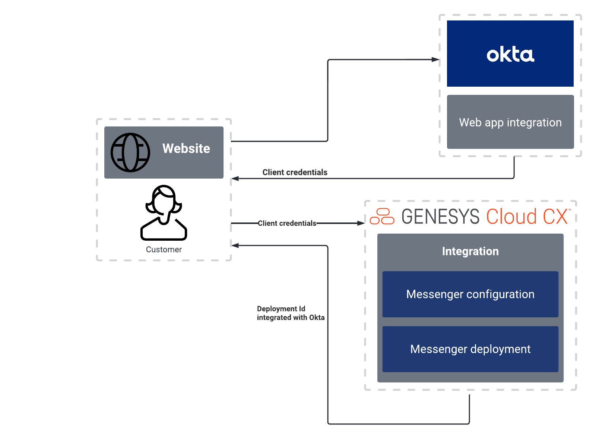

## Solution components

**Genesys Cloud** - A suite of Genesys cloud services for enterprise-grade communications, collaboration, and contact center management. In this solution, a Genesys Cloud user account is required for your application to be authorized to integrate with Messenger.

## Prerequisites

### Specialized knowledge

* Administrator-level knowledge of Genesys Cloud

## Genesys Cloud account

* A Genesys Cloud license. For more information, see [Genesys Cloud pricing](https://www.genesys.com/pricing "Opens the Genesys Cloud pricing page") on the Genesys website.
* (Recommended) The Master Admin role in Genesys Cloud. For more information, see [Roles and permissions overview](https://help.mypurecloud.com/?p=24360 "Opens the Roles and permissions overview article") in the Genesys Cloud Resource Center.

## Okta Developer Edition account

* An Okta Developer Edition account. For more information, see [the Okta Developer page](https://developer.okta.com/signup/ "Goes to the Okta Developer page on the Okta website").

## Implementation steps

### Set up Okta

1. Log in to your Okta Developer Edition account.
2. In the left panel, click **Applications > Applications**. 
3. Click **Create App Integration**.

  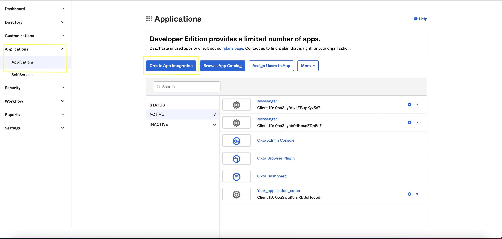

4. On the Create a new app integration page, in the Sign-in method section, click **OpenID Connect**.
5. For the application type, select **Web Application** and then click **Next**.
6. On the New Web App Integration page, in the **App integration name** box, type a name for your app integration.
7. For **Grant type**, **Authorization code** is mandatory and select **Refresh token** if required. 

:::primary
 **Note**: Refresh token is required to obtain a new access token if the existing access token has expired.
:::

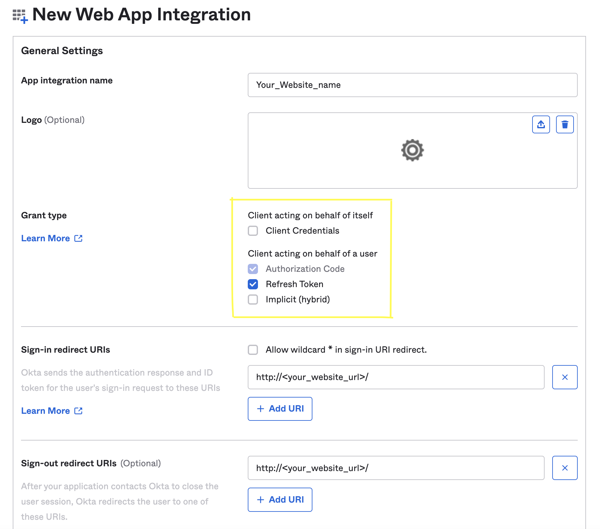

8. Add the **Sign-in redirect URIs**. 
	* Add full page URL where messenger have to redirect after login.
9. Add the **Sign-out redirect URIs**.
	* Add full page URL where messenger have to redirect after logout.
10. Under **Security**, click **API** > **Trusted Origin** and add your web page origin in the Okta account.
11. In the **Assignment** section, select the option that best suits your organization and click **Save**. This creates the client credentials.
12. To find the Okta URL, navigate to **Security** > **API** and click **Default**. The Okta URL appears in the **Issuer** section.
14. Make a note of these items, which you will need later: 
 	* Okta client credentials 
	* Okta URL  

### Create an Oauth integration in Genesys Cloud

1. Log in to your Genesys Cloud account and click **Admin** > **Integrations** > **+Integrations**.

  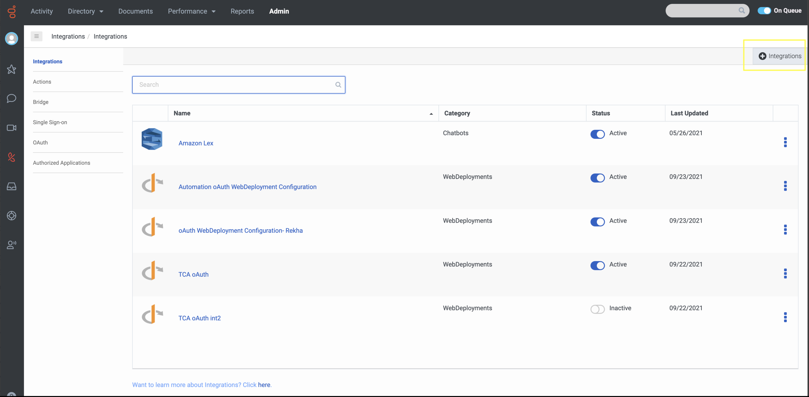

3. Install the **OpenID Connect Messenger Configuration**.

  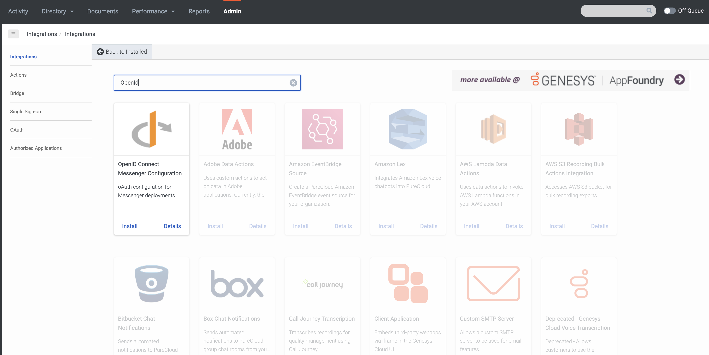

4. In the **Configuration** section, paste the Discovery Uri. For example, `https://<okta-user-domain>/oauth2/default/.well-known/openid-configuration`.
	
  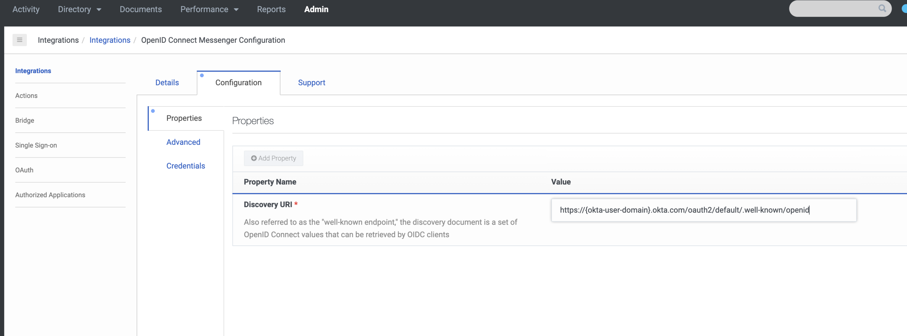

5. In **Credentials** section, click **Configure** and provide the Okta client credentials.
6. Click **Save**.
7. On the main Integrations page, set your new integration to **Active**.

  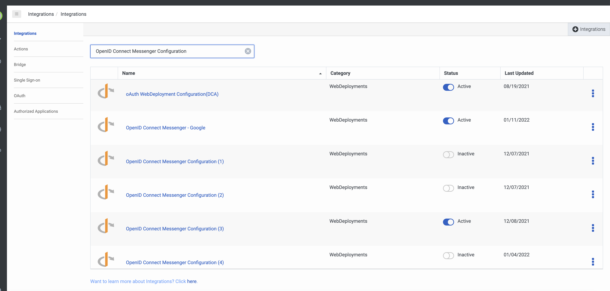

## Update the Messenger configuration

1. In Genesys Cloud > **Admin**, under **Message**, click **Messenger Configurations**. 
2. Enable Authentication.
3. From the list, select the [**OAuth integration** you created](#create-an-oauth-integration-in-Genesys-Cloud "Goes to Create an Oauth integration in Genesys Cloud section").

  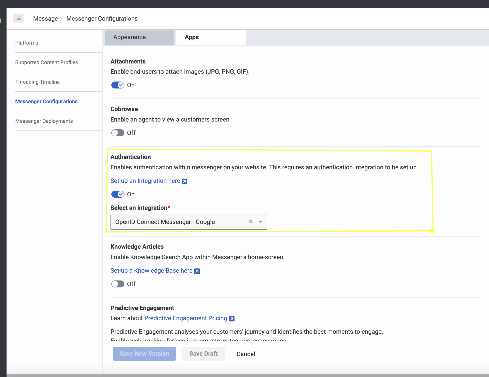

## Update the Messenger deployment

1. In Genesys Cloud > **Admin**, under **Message**, click **Messenger Deployments**, and then select [the configuration that you created](#update-the-messenger-configuration "Goes to the Update the Messenger configuration section").

 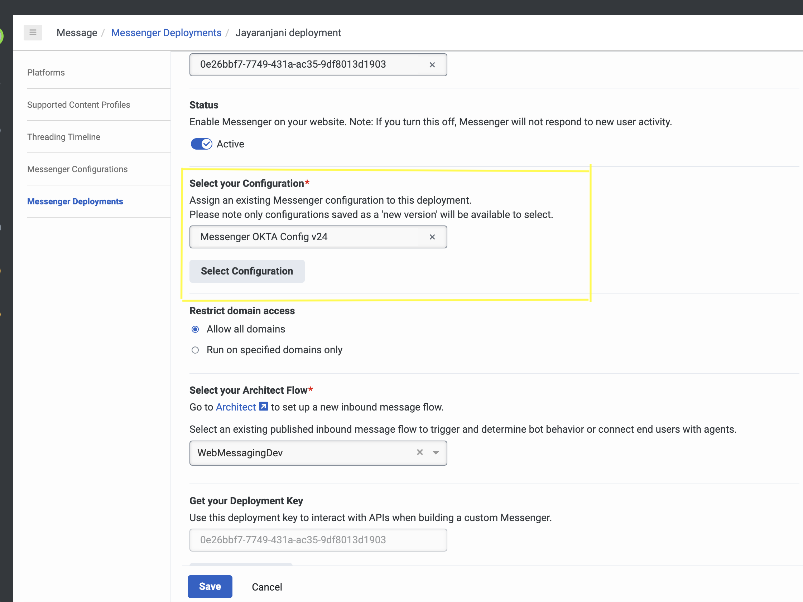

3. Save the deployment. This creates the snippet that you need.
4. Deploy the snippet on the website where you want Messenger to appear.

 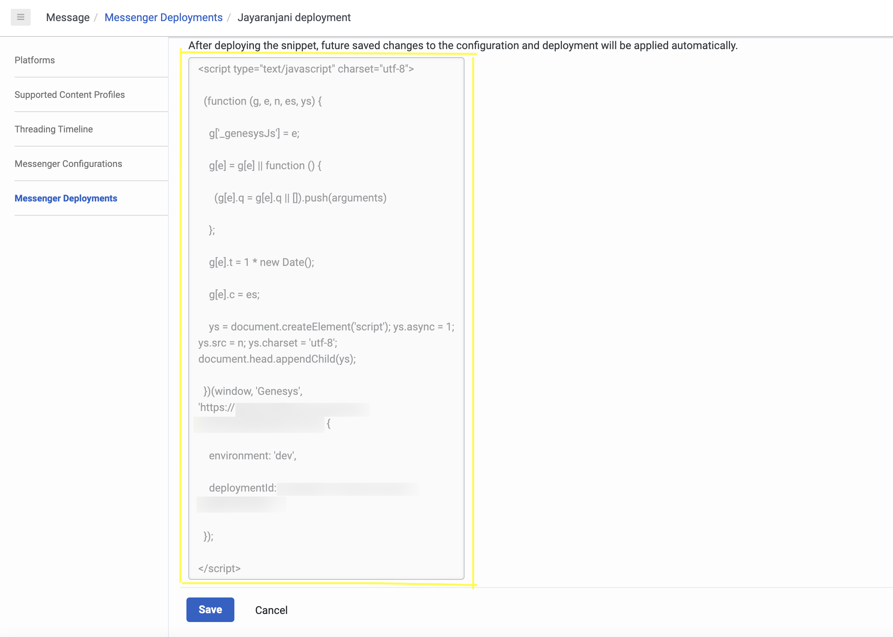

:::primary
**Note**: From the snippet, make a note of the deployment ID and environment. You can use these values to [run the sample app](#run-the-sample-app "Goes to the Run the sample app section").
:::

## Configure the authenticated Messenger

1. Write necessary code to configure authenticated web messaging for Messenger when it runs in your webpage.

2. To enable the Okta Sign-In experience using JavaScript, do either of the following:  
  * [Enable authenticated sign-in with the Okta Auth JavaScript SDK](#enable-authenticated-sign-in-with-the-Okta-Auth-JavaScript-SDK "Goes to the Enable authenticated sign-in with the Okta Auth JavaScript SDK section").
  * [Enable authenticated sign-in with the OAuth endpoint](#enable-authenticated-sign-in-with-the-oauth-endpoint "Goes to the Enable authenticated sign-in with the OAuth endpoint section").

### Enable authenticated sign-in with the Okta Auth JavaScript SDK  

Follow these steps to include the Okta Auth JavaScript SDK in your webpage.

1. Get the [Okta Auth JavaScript SDK](https://global.oktacdn.com/okta-auth-js/5.2.2/okta-auth-js.min.js "Okta Auth JavaScript SDK"). 

2. Include the okta-auth-js library in your webpage.

	```{"title":Okta Auth JavaScript SDK","language":"html"}
	<script src="https://global.oktacdn.com/okta-auth-js/5.2.2/okta-auth-js.min.js" type="text/javascript"></script>
	```
3. Create an instance of the OktaAuth object and configure the Okta authorization options.

	```{"title":"OktaAuth Object","language":"JavaScript"}
	const oktaConfig = {
		redirectUri: <signInRedirectUri>,
		postLogoutRedirectUri: <signOutRedirectUri>,
		clientId: <ClientId>,
		issuer: <Okta URL>,
		scopes: ['openid', 'email', 'profile', 'offline_access'],
		pkce: false, // default is true. Set to 'false' in case of implcit/authorization code flow
		responseType: 'code',
		maxAge : <MaxAge>
	};
	const authClient = new OktaAuth(oktaConfig)		
	```

The following table describes the parameters for the OktaAuth object.

| Parameter | Description |
| --------- |----------|
| `redirectUri` | Specify the URL to where the browser should redirect the user after they signIn. Use your full page URL, which is listed in your Okta application's Sign-in redirect URIs.|
| `postLogoutRedirectUri` | Specify the URL where the browser should redirect the user after signOut. Use your full page URL, which is listed in your Okta application's Sign-out redirect URIs. If you do not specify this value, your application's origin (window.location.origin) will be used.|
| `clientId` | Specify the clientID that was generated when you [set up your Okta app](#set-up-okta "Goes to the Set up Okta section").|
| `issuer` | Specify the Okta URL that is listed in your Okta Developer Edition account under **Security** > **API** > **default**.|
| `scopes`| If required, set the auth scopes to specify the access privileges that are being requested as part of authorization.|
| `pkce` | The default value is true, which enables the PKCE OAuth flow. To use the Implicit flow or the Authorization Code flow, set this option to false. **Note**: The PKCE OAuth flow works only with a secure domain. |
| `responseType`| To use the Authorization Code grant type, set this option to **code**.|
| `maxAge` | Specify the allowable elapsed time, in seconds, since the last time the end user was actively authenticated by Okta.|
| `nonce` |  The Okta Auth JavaScript SDK generates this random value. This value is stored in cookie and session storage. You can also pass your preferred nonce value as a paramater to the OktaAuth object if you want to overwrite the generated nonce value. <br/> **Note**: nonce is mandatory to resolve in  [getAuthCode](https://developer.genesys.cloud/api/digital/webmessaging/messengersdk/SDKCommandsEvents#authprovider-plugin "Goes to the Commands and events page") command when using OKTA SDK approach|
	{: class="table-striped table-bordered"}

	```{"title":"How to extract nonce from session storage","language":"JavaScript"}
		let oktaTransactionStorage = window.sessionStorage.getItem("okta-transaction-storage"); // Get 'okta-transaction-storage' value from session storage

		if (oktaTransactionStorage) {
		const storage = JSON.parse(oktaTransactionStorage); // Convert text in 'oktaTransactionStorage' to javascript object

		if (storage && Object.keys(storage).length) { // If 'storage' is present destructure nonce from 'storage'
		const { nonce } = storage || {};
		}
		}
	```


4. To trigger the signIn action, call the **signInWithRedirect** method with the request parameters. The **originalUri** parameter tracks where the user came from before they signed in. The additional parameters are mapped to the Authorize options. You can trigger the sign-in action via a link, button, and so on.

	```{"title":"OktaAuth signInWithRedirect method","language":"JavaScript"}
		authClient.signInWithRedirect({
		originalUri: <your current page url here>,
		...oktaConfig
		});
	```

### Enable authenticated sign-in with the OAuth endpoint

1. Generate the **Auth URL** and trigger the login action. You can trigger this action when the user clicks a link, button, or interacts with another UI element, for example.  

Your request URL looks like this:

```{"title":"Example request URL","language":"html"}
authURL = `<DomainURL>client_id=<ClientId>&scope=openid%20email%20profile%20offline_access&response_type=code&redirect_uri=<RedirectURL>&state=eyJiYWNrVG9QYXRoIjoiL3ByaXZhdGUiLCJpc3N1ZXIiOiJva3RhIiwiYnl0ZXMiOiItSEhlWEV3YmNRak5fQWl3a0NkanVDNEZpQ1VPRV81emkzeFlKa1BQaWcwIn0%3D`
```

If you enable the PKCE OAuth flow, your request URL looks like this: 

```{"title":"Example request URL with PKCE OAuth flow enabled","language":"html"}
authURL = `<DomainURL>client_id=<ClientId>&scope=openid%20email%20profile%20offline_access&response_type=code&redirect_uri=<RedirectURL>&state=eyJiYWNrVG9QYXRoIjoiL3ByaXZhdGUiLCJpc3N1ZXIiOiJva3RhIiwiYnl0ZXMiOiItSEhlWEV3YmNRak5fQWl3a0NkanVDNEZpQ1VPRV81emkzeFlKa1BQaWcwIn0%3D&code_challenge_method=S256&code_challenge=<codeChallenge>`
```

If you add the optional parameters, `nonce` and `maxAge`, your request URL looks like this:

```{"title":"Example request URL with optional parameters nonce and maxAge","language":"html"}
authURL = `<DomainURL>client_id=<ClientId>&scope=openid%20email%20profile%20offline_access&response_type=code&redirect_uri=<RedirectURL>&state=eyJiYWNrVG9QYXRoIjoiL3ByaXZhdGUiLCJpc3N1ZXIiOiJva3RhIiwiYnl0ZXMiOiItSEhlWEV3YmNRak5fQWl3a0NkanVDNEZpQ1VPRV81emkzeFlKa1BQaWcwIn0%3D&nonce=<nonce>&max_age=<maxAge>`
```

The following table describes the parameters for the Auth URL.

| Parameter | Description |
| --------- |----------|
| `DomainURL` | Specify the authorization server's endpoint (https://{yourOktaDomain}/oauth2/default/v1/authorize).|
| `ClientId`  | Specify the clientID that was generated when you [set up your Okta app](#set-up-okta "Goes to the Set up Okta section").|
| `RedirectURL`| Specify the URL to where the browser should be redirected when the user signs in. This must be your full page URL, which is listed in your Okta application's sign-in redirect URIs.|
| `Auth scopes`| Set auth scopes to specify the access privileges that are being requested as part of the authorization, if required.|
| `response_type`| Set this parameter to **code** to use the **Authorization Code** grant type.|
| `max_age` | Specify the allowable elapsed time, in seconds, since the last time the end user was actively authenticated by Okta.|
| `nonce` | Specify a random string value, preferably an UUID format, that is returned in the ID token. |
| `codeChallenge` | Specify the string value that the code verifier generated to support the PKCE OAuth flow. `codeChallenge` is verified in the access token request. **Note**: Code verifier is any random string value between 43 and 128 characters long. Okta uses it to recompute the code_challenge and verify if it matches the original code_challenge in the authorization request. For more information, see [the Flow specifics section in the Okta Developer Edition documentation](https://developer.okta.com/docs/guides/implement-grant-type/authcodepkce/main/#flow-specifics "Goes to the Flow specifics section of the Implement authorization by grant type page in the Okta Developer Edition documentation") or the [Sample code to generate code verifier and code challenge](#sample-code-to-generate-code-verifier-and-code-challenge "Goes to the Sample code to generate code verifier and code challenge section").|
| `codeChallengeMethod` | Method used to derive the code challenge for PKCE Oauth flow. The valid value is `S256`. |
	{: class="table-striped table-bordered"}

2. If the user does not have an existing Okta session, making this request opens the **Okta** sign-in page.
3. If the user does have an existing Okta session, they arrive at the specified redirect_uri along with a code, as shown in the following code snippet.

```{"title":"Redirect url appended with code and state","language":"javascript"}
https://mypureclloud.com/?code=P5I7mdxxdv13_JfXrCSq&state=state-296bc9a0-a2a2-4a57-be1a-d0e2fd9bb601 // Code specifies Okta authcode
```

4. The redirect_uri may also contain the optional **iss** parameter when the authorization server has **authorization_response_iss_parameter_supported** set to true. This results in the issuer URL being returned along with the code as shown in the code snippet below.

```{"title":"Redirect url appended with code, state and iss","language":"javascript"}
https://mypureclloud.com/?code=P5I7mdxxdv13_JfXrCSq&state=state-296bc9a0-a2a2-4a57-be1a-d0e2fd9bb601&iss=https://{okta-user-domain}.okta.com/oauth2/default // Code specifies Okta authcode and iss specifies Okta issuer URL
```

5. The page is reloaded when the user is redirected from the **Okta** sign-in page. The page reload initializes the [Auth plugin](https://developer.genesys.cloud/api/digital/webmessaging/messengersdk/SDKCommandsEvents#auth-plugin "Goes to the Commands and events page") and calls its [getTokens command](https://developer.genesys.cloud/api/digital/webmessaging/messengersdk/SDKCommandsEvents#auth-plugin "Goes to the Commands and events page") for authentication.
6. From the redirect URL, split the **OKTA** authcode.
7. Create your AuthProvider plugin and register the [getAuthCode](https://developer.genesys.cloud/api/digital/webmessaging/messengersdk/SDKCommandsEvents#authprovider-plugin "Goes to the Commands and events page") command.

```{"title":"Prepare the AuthProvider plugin","language":"javascript"}
Genesys('registerPlugin', 'AuthProvider', (AuthProvider) => {

  // COMMAND
  // *********
  // getAuthCode

  let oktaTransactionStorage = window.document.cookie.toString(); // Get nonce from cookie

  if (oktaTransactionStorage) {
  const storage = oktaTransactionStorage.split('okta-oauth-nonce=')[1]; // Extract 'okta-oauth-nonce' cookie from 'oktaTransactionStorage'
  const nonce = storage.split(';')[0];
  }

  const urlParams = new URLSearchParams(window.location.search); // Get the authorization response which is added as a query string from the redirect URL
  const authCode = urlParams.has('code') ? urlParams.get('code'); // Get code from the query string
  const iss = urlParams.has('iss') ? urlParams.get('iss'); // Get optional iss parameter from the query string. urlParams will decode this issuer URL if it is encoded.

  /* Register Command - mandatory */

  AuthProvider.registerCommand('getAuthCode', (e) => {

  //Messenger calls this command to get the the tokens.

  e.resolve({
      authCode: <authCode>,			// Pass your authCode here
      redirectUri: <your redirect uri>,	   // Pass the redirection URI configured in your authentication provider here
      nonce: <nonce>,				//  Mandatory parameter in OKTA Javascript SDK approach.
      maxAge: <maxAge>				// Pass the elapsed time in seconds as an optional parameter
      codeVerifier: <codeVerifier>		// For PKCE Oauth flow: If you use the Okta Auth JavaScript SDK to authenticate signin, get the code verifier from session storage. If you use the endpoint to authenticate signin, pass a cryptographically random string that you used to generate the codeChallenge value.
      iss: <iss>					// Pass the optional parameter iss if it was returned in the authorization response by your Authentication provider.
    });
  });
});
```

:::primary
**Note**: 
- With OKTA SDK approach **nonce** option is mandatory to resolve in [getAuthCode](https://developer.genesys.cloud/api/digital/webmessaging/messengersdk/SDKCommandsEvents#authprovider-plugin "Goes to the Commands and events page") command.
- The **redirectUri** option must match the **Sign-in redirect URI** specified in OKTA Developer Edition account.
:::

8. To trigger the sign-out action, call the Okta Auth JavaScript SDK's **signOut** method after the [Auth.logout command](https://developer.genesys.cloud/api/digital/webmessaging/messengersdk/SDKCommandsEvents#auth-logout "Goes to Auth provider plugin"). You can trigger this action when the user clicks a link, button, or interacts with another UI element, for example.  

```{"title":"OktaAuth signOut method","language":"JavaScript"}
AuthProvider.command('Auth.logout').finally(() => {
	authClient.signOut();
});
```

### Sample code to generate code verifier and code challenge

```{"title":"Sample code to generate code verifier and code challenge","language":"javascript"}
//Code Verifier
function generateCodeVerifier(length) {
 let text = '';
 const possible = 'ABCDEFGHIJKLMNOPQRSTUVWXYZabcdefghijklmnopqrstuvwxyz0123456789-._~';
 for (let i = 0; i < length; i++) {
    text += possible.charAt(Math.floor(Math.random() * possible.length));
 }

return text;
}

//Code challenge
function generateCodeChallenge(codeVerifier) {
 return base64URL(CryptoJS.SHA256(codeVerifier)); // eslint-disable-line
}
function base64URL(data) {
 return data.toString(CryptoJS.enc.Base64).replace(/=/g, '').replace(/\+/g, '-').replace(/\//g, '_'); // eslint-disable-line
}

verifier = generateCodeVerifier(128); //Generate code verifier for PKCE support in OAuth
const challenge = generateCodeChallenge(verifier); // eslint-disable-line //Generate code challenge for PKCE support in OAuth
```

### Run the sample app

This blueprint includes a sample app that you can run locally or from the Blueprint repo.

:::primary
**Note**: Regardless of the location from where you run the sample app, you need a Genesys Cloud user account in order for it to work. Our sample app [enables authenticated sign-in with the Okta Auth JavaScript SDK](#enable-authenticated-sign-in-with-the-Okta-Auth-JavaScript-SDK "Goes to the Enable authenticated sign-in with the Okta Auth JavaScript SDK section).
:::

To run the sample app from the Blueprint repo:

1. Click [here](https://genesyscloudblueprints.github.io/messenger-authentication-okta-integration-blueprint/oauth.html "Goes to the sample app").

2. Enter the environment and deployment Id that you configured with Okta and click **Submit**.

3. Enter the client credentials for authenticated web messaging.

:::primary
 **Note**: See the source code for sample app [here](https://github.com/GenesysCloudBlueprints/messenger-authentication-okta-integration-blueprint/blob/main/docs/oauth.html "Goes to source code for the sample app in this blueprint").
:::

### OKTA debugging guidelines

OKTA consists of a debugging tool that helps you to monitor the activity and security of your org. The **System Log** contains details of all logged events for your org. To navigate to the System Log, Log in to your Okta Developer Edition account, go to **Reports > System Log**. We can debug whether the request from Genesys Cloud reached Okta APIs in event info column under events table.

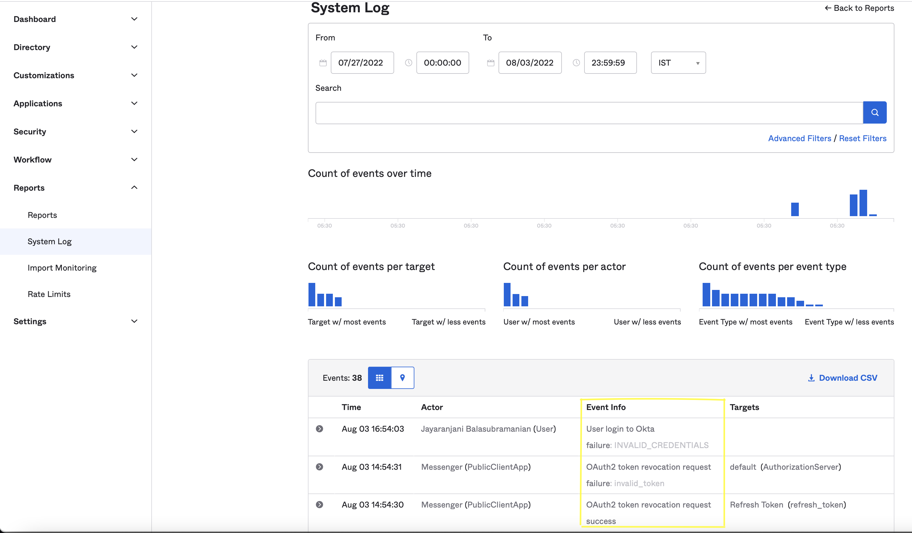

## Additional resources 

* [Platform API](/api/digital/webmessaging/authenticate "Goes to the Authenticated WebMessaging page in the Genesys Cloud Developer Center")

